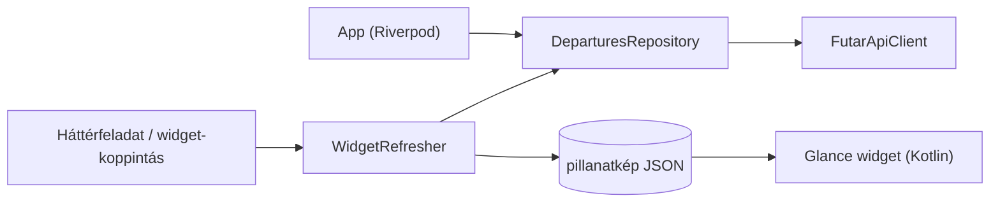

# Indulj

Android widget és egy kis Flutter app, ami a kedvenc budapesti megállóim
következő indulásait mutatja a BKK FUTÁR nyílt adataiból. A cél az volt, hogy
ne kelljen appot nyitni ahhoz, hogy lássam, mikor jön a következő járat.

<p>
  
  &nbsp;
  
</p>

## Funkciók

- Widget (Jetpack Glance, 2×1 és 4×2) 1–3 megállócsoporttal: járatszám,
  célállomás, indulási idő, késés, zavar jelzése. Az első sornál visszaszámlálás
  fut.
- A widgeten a ⟳ gomb azonnal frissít, a ⚠ megnyitja a zavar leírását az appban.
- Az appban élő indulási tábla, ami 30 másodpercenként frissül, és lehúzással is
  frissíthető.
- Megállókeresés név vagy közelség alapján. Egy csoportba több peron vagy egy
  egész állomás is mehet, és szűrni lehet járatra (pl. csak 4-es és 6-os).
- Offline az utolsó adat látszik, „elavult" jelzéssel.

## Amit a widgetekről tanultam

Azt hittem, a widget majd percenként frissül, de az Android ezt nem engedi: az
`updatePeriodMillis` minimum 30 perc, a periodikus WorkManager 15 perc, és a
gyártók akkukímélője ezt is elnyomhatja. Ha a widget azt írná, hogy „3 perc
múlva", az fél óra múlva is ott lenne, és hazudna.

Ezért végül így oldottam meg:

- A widget pontos időt mutat („14:37"), mert az legfeljebb elavul, de nem lesz
  hamis. Csak az első sorban van visszaszámlálás, azt egy natív `Chronometer`
  számolja, ami frissítés nélkül is megy.
- Ki van írva, mikor frissült, és 20 perc után elszürkül.
- Frissítés koppintásra, az app megnyitásakor, és 15 percenként a háttérben.
- Az indulások idejére be van ütemezve egy újrarajzolás (AlarmManager, API-hívás
  nélkül), így az elment járat eltűnik a listából.

## Felépítés

Az API-hívás és a feldolgozás csak a Dart oldalon van. A Dart egy JSON
pillanatképet ír a widget SharedPreferences-ébe, a Kotlin widget pedig csak
megjeleníti. Így csak egy parserem van, és azt Dartban tudom tesztelni.



A pillanatképben van egy verziószám, és a Dart és a Kotlin oldal ugyanazokat a
teszt fixture-öket használja (`test/fixtures/snapshots/`), hogy ne csússzon szét
a kettő. Belül minden időt UTC ms-ben tárolok, helyi időre csak kiíráskor
váltok, és a tesztek az óraátállítást és az éjfél utáni indulásokat is lefedik.

```
lib/
  core/            env, óra
  data/futar/      API-kliens, DTO-k
  domain/          modellek, indulási tábla logikája
  widget_bridge/   pillanatkép, widget frissítése
  features/        keresés, kedvencek, tábla, widget beállítás, névjegy
android/.../widget/  Glance widget, SnapshotReader
tool/              fixture rögzítő, lefedettség-ellenőrzés
```

A döntéseimet a [docs/DECISIONS.md](docs/DECISIONS.md)-ben gyűjtöttem.

## Futtatás

1. Kell egy API-kulcs: https://opendata.bkk.hu
2. Másold le az `env.example.json`-t `env.json` néven, és írd bele a kulcsot.
   (Az `env.json` benne van a gitignore-ban.)
3. ```sh
   flutter pub get
   flutter run --dart-define-from-file=env.json
   ```

Tesztek:

```sh
flutter analyze
flutter test
flutter test --tags live --dart-define-from-file=env.json   # valódi API-val
cd android && ./gradlew :app:testDebugUnitTest              # Kotlin tesztek
```

Új fixture rögzítése valódi API-ból (a kulcsot kiveszi a fájlból):

```sh
dart run tool/record_fixture.dart arrivals <név> <stopId...>
```

## Ismert korlátok

- Az API-kulcs fordításkor kerül az appba, így az APK-ból ki lehet szedni. Egy
  saját használatú appnál ez szerintem oké, egy rendes kiadáshoz viszont kellene
  egy proxy szerver.
- Egyes telefonokon (Samsung, Xiaomi) az akkukímélő megállíthatja a háttér
  frissítést. Ilyenkor érdemes az app akkubeállítását „Nem korlátozott"-ra
  állítani, gyártónként itt van leírás: https://dontkillmyapp.com
- Az app 30 másodpercnél sűrűbben nem kérdezi le ugyanazt, mert a BKK ezt kéri.

## Licenc és adatforrás

A kód [MIT](LICENSE) licencű.

Az adatok forrása a BKK Zrt. – BKK FUTÁR (https://opendata.bkk.hu),
[CC BY 4.0](https://creativecommons.org/licenses/by/4.0/) licenc alatt. Az app
szűri és átalakítja az adatokat. Az appot a BKK nem támogatja és nem hagyta jóvá.
