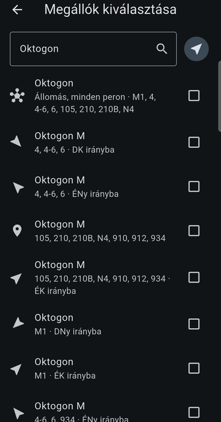
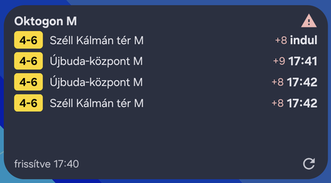
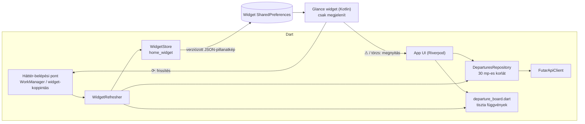

# Indulj — BKK indulási widget

Android kezdőképernyő-widget és kis Flutter-app, ami 1–3 kedvenc budapesti
megállócsoport következő indulásait mutatja a BKK FUTÁR nyílt adataiból.

<p>
  
  &nbsp;
  
</p>

## Mit tud

- **Widget** (Jetpack Glance, 2×1 és 4×2): színes járatjelvények, célállomás,
  időpont, késés („+2"), zavar-jelzés. Az első sor natív visszaszámlálóval
  jár. Koppintás a ⟳-ra: azonnali frissítés; a ⚠-ra: a zavar szövege az
  appban.
- **Élő indulási tábla** az appban: 30 mp-enként frissül, háttérben szünetel,
  lehúzással is frissíthető.
- **Megállókeresés** név és közelség alapján. Egy csoportba több peron vagy
  egy egész állomás is kerülhet, járatszűrővel (pl. csak a 4-es és a 6-os).
- **Offline**: az utolsó ismert állapot látszik, „elavult" jelöléssel.
- Hibaállapotok: nincs net, érvénytelen API-kulcs, nincs indulás.

## A legfontosabb tanulság: a widget nem valós idejű

Az Android ritkán engedi frissíteni a widgeteket: az `updatePeriodMillis`
minimuma 30 perc, a periodikus WorkManager-feladaté 15 perc, és a gyártói
akkukímélők ezt is megnyirbálhatják. Egy „3 perc múlva" felirat így fél óra
múlva is ott állna, tévesen. Ezért:

- **Abszolút időpontot mutatunk** („14:37"). Ez legfeljebb elavul, de nem
  válik hamissá. Relatív idő csak az első sorban van, egy natív `Chronometer`
  számol vissza, ami a widget frissítése nélkül is jár.
- **A frissesség látszik**: „frissítve 14:21". 20 perc után szürke, „elavult".
- **Akkor frissítünk, amikor számít**: koppintásra, az app megnyitásakor, és
  tartalékként 15 percenként a háttérben.
- A widget két frissítés között „befagy". Az indulások pillanatában és 30 mp-cel
  utána ütemezett újrarajzolás (AlarmManager, API-hívás nélkül) váltja az első
  sort „indul"-ra, majd a következőre.

## Architektúra



- **Egyetlen parser, Dartban.** A Kotlin oldal nem hív API-t és nem számol
  indulást. Kész pillanatképet jelenít meg, és csak a megjelenítéshez szükséges
  dolgokat végzi (időformázás, elavultság, elment sorok elrejtése).
- **A pillanatkép sémája verziózott** (`"v": 1`). Ismeretlen verziónál a widget
  „Nyisd meg az appot" állapotot mutat, nem omlik össze. A két oldal
  szerződését ugyanaz a fájlkészlet védi: a Dart codec-teszt írja
  (`test/fixtures/snapshots/`), a Kotlin `SnapshotReaderTest` olvassa.
- **Idő**: belül minden UTC epoch ms; helyi időre csak a megjelenítésnél
  váltunk. A tesztek a márciusi és az októberi óraátállítást és az éjfél utáni
  indulásokat is lefedik, gépfüggetlen budapesti időzónával.
- **Fixture-alapú API-modell**: a mezőneveket valódi, rögzített válaszokból
  vettük (`tool/record_fixture.dart`), nem a specből találgatva.

A döntések és indokaik: [docs/DECISIONS.md](docs/DECISIONS.md).

```
lib/
  core/            env, óra, Result
  data/futar/      API-kliens, DTO-k, mapperek
  domain/          modellek, departure_board.dart (tiszta Dart)
  widget_bridge/   pillanatkép-codec, WidgetRefresher, háttér-belépési pontok
  features/        stop_search, favorites, board, widget_config, about
android/app/src/main/kotlin/hu/seyuyo/indulj/widget/
                   Glance widget, SnapshotReader
tool/              record_fixture.dart, check_coverage.dart
```

## Futtatás

1. Regisztrálj és kérj kulcsot: https://opendata.bkk.hu
2. `cp env.example.json env.json`, és írd bele a kulcsot (`FUTAR_API_KEY`).
   Az `env.json` gitignore-ban van.
3. Futtatás:

```sh
flutter pub get
flutter run --dart-define-from-file=env.json
```

A widget felrakásakor megnyílik az app, és kiválaszthatod, melyik csoportot
mutassa.

### Tesztek

```sh
flutter analyze
flutter test                                              # élő tesztek nélkül
flutter test --tags live --dart-define-from-file=env.json # élő smoke-teszt
dart run tool/check_coverage.dart lib/domain 95           # flutter test --coverage után
cd android && ./gradlew :app:testDebugUnitTest            # Kotlin JVM-tesztek
```

Új fixture rögzítése (a kulcsot a mentett fájlból eltávolítja):

```sh
dart run tool/record_fixture.dart arrivals <név> <stopId...>
dart run tool/record_fixture.dart search <név> <keresőszó>
dart run tool/record_fixture.dart nearby <név> <lat> <lon>
```

## Az API-kulcs kompromisszuma

A kulcs fordítási idejű konstans (`--dart-define-from-file`). Így a widget
háttér-isolate-jában is elérhető, és soha nem kerül a repóba, logba vagy
fixture-be. **Az APK-ból viszont kinyerhető.** Személyes vagy portfólió-appnál
ez elfogadott kompromisszum. Éles apphoz saját proxy-szerver kellene, ami a
kulcsot tartja; ez nincs a projekt céljai között.

## Akkukímélők

Egyes gyártók (Samsung, Xiaomi stb.) elnyomhatják a háttérfrissítést. A fő
frissítési út ezért a koppintás. Ha a widget nem frissül magától, az Indulj
akkubeállítását érdemes „Nem korlátozott"-ra állítani; gyártónként:
https://dontkillmyapp.com

Az app 30 másodpercnél gyakrabban soha nem kérdezi az API-t (a BKK kérése
szerint).

## Adatforrás és licenc

Adatforrás: **BKK Zrt. – BKK FUTÁR** (https://opendata.bkk.hu), a
[CC BY 4.0](https://creativecommons.org/licenses/by/4.0/) licenc alatt. Az app
az adatokat szűri, rendezi és átalakítja; a BKK nem támogatja és nem hagyta
jóvá az appot. A forrásmegjelölés az app Névjegy oldalán és licenclistájában
is szerepel.
